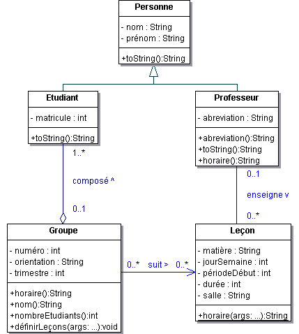

[](https://classroom.github.com/a/k3ebQfrR)
# Laboratoire 6: Ecole

_Durée du laboratoire: 4 périodes. A rendre le mercredi 15 novembre 2023, au début de la séance de laboratoire (13h15)._

_A rendre sur github, branche main._

Bonnes pratiques: https://heigvd-poo.github.io/Intro/
Intro à Maven: https://heigvd-poo.github.io/Intro/MAVEN_INTRO

## UML

Le diagramme de classes UML fourni ci-dessous s’inspire de la donnée du laboratoire 2 (en particulier les départements, et donc leurs doyens, n’y sont pas représentés).



## Instructions

Implémenter ce diagramme de classe en prenant garde à bien factoriser les traitements et en ne pas compromettant pas l’encapsulation des données.

Définir une classe de test contenant la méthode `main()` de l’application.

1. Définir les professeurs *Daniel Rossier (DRE)* et *Pier Donini (PDO)*.
2. Définir les trois leçons du cours de *POO (PDO)*, la leçon du cours *SYE (DRE)* ainsi qu’une leçon *TIC (projet non encadré)*.
3. Définir les étudiants *John Lennon*, *Paul Mc Cartney*, *Ringo Starr*, *George Harisson*, *Roger Waters* et *David Gilmour*.
4. Définir un groupe *IL6-1* contenant les quatre premiers étudiants et un groupe *SI6-1* contenant les deux derniers.
5. Affecter au groupe *IL6-1* toutes les leçons existantes. Affecter au groupe *SI6-1* toutes les leçons de *POO*.
6. Définir un tableau contenant toutes les personnes et en afficher les éléments en tirant parti du mécanisme de liaison dynamique.
7. Afficher les informations relatives au groupe *IL6-1* (nom, nombre d’étudiants, horaire).
8. Afficher l’horaire du professeur *PDO*.

## Indications

- Hormis les constructeurs, toutes les méthodes publiques nécessaires au programme sont décrites dans le diagramme de classes (on ne s’interessera pas ici à la modification de l’état des objets créés).
- D’autres méthodes (non publiques) peuvent toutefois se révéler nécessaires.
- La méthode `horaire()` dans la classe Leçon est statique (indépendante de tout objet)
- La méthode statique `format()` de la classe `String` permet d’obtenir une chaîne de caractères formattée (de manière analogue à la fonction `fprintf` en C).
- Une méthode statique peut être invoquée en préfixant la méthode par le nom de la classe où elle est définie (p.ex. `String.format("%10s %2d", foo, 42);`).

## Sortie du programme

```shell
-- Membres de l'ecole

Prof. Pier Donini (PDO)
Prof. Daniel Rossier (DRE)
Etud. John Lennon (#1234) - IL6-1
Etud. Paul Mc Cartney (#2341) - IL6-1
Etud. Ringo Starr (#3241) - IL6-1
Etud. George Harisson (#4321) - IL6-1
Etud. Roger Waters (#1324) - SI6-1
Etud. David Gilmour (#4312) - SI6-1

-- Horaire du groupe IL6-1 (4 etudiants)

     | Lun         | Mar         | Mer         | Jeu         | Ven         |
     |-------------|-------------|-------------|-------------|-------------|
 8:30|SYE   G01 DRE|             |             |             |             |
     |             |-------------|-------------|-------------|-------------|
 9:15|             |             |             |             |             |
     |-------------|-------------|-------------|-------------|-------------|
10:25|             |             |             |SYE   A09 DRE|             |
     |-------------|-------------|-------------|             |-------------|
11:15|             |             |             |             |             |
     |-------------|-------------|-------------|-------------|-------------|
12:00|             |             |             |             |             |
     |-------------|-------------|-------------|-------------|-------------|
13:15|             |             |POO   H02 PDO|POO   H02 PDO|             |
     |-------------|-------------|             |             |-------------|
14:00|             |             |             |             |             |
     |-------------|-------------|-------------|-------------|-------------|
14:55|             |             |             |POO   H02 PDO|             |
     |-------------|-------------|-------------|             |-------------|
15:45|             |             |             |             |             |
     |-------------|-------------|-------------|-------------|-------------|
16:35|             |TIC   F06    |             |             |             |
     |-------------|-------------|-------------|-------------|-------------|
17:20|             |             |             |             |             |
     |-------------|-------------|-------------|-------------|-------------|

-- Horaire Prof. Pier Donini (PDO)
     | Lun         | Mar         | Mer         | Jeu         | Ven         |
     |-------------|-------------|-------------|-------------|-------------|
 8:30|             |             |             |             |             |
     |-------------|-------------|-------------|-------------|-------------|
 9:15|             |             |             |             |             |
     |-------------|-------------|-------------|-------------|-------------|
10:25|             |             |             |             |             |
     |-------------|-------------|-------------|-------------|-------------|
11:15|             |             |             |             |             |
     |-------------|-------------|-------------|-------------|-------------|
12:00|             |             |             |             |             |
     |-------------|-------------|-------------|-------------|-------------|
13:15|             |             |POO   H02 PDO|POO   H02 PDO|             |
     |-------------|-------------|             |             |-------------|
14:00|             |             |             |             |             |
     |-------------|-------------|-------------|-------------|-------------|
14:55|             |             |             |POO   H02 PDO|             |
     |-------------|-------------|-------------|             |-------------|
15:45|             |             |             |             |             |
     |-------------|-------------|-------------|-------------|-------------|
16:35|             |             |             |             |             |
     |-------------|-------------|-------------|-------------|-------------|
17:20|             |             |             |             |             |
     |-------------|-------------|-------------|-------------|-------------|
```