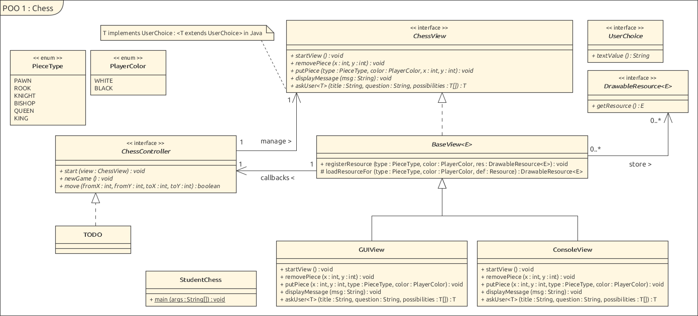
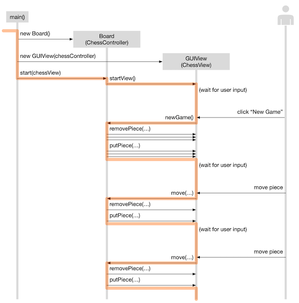

[](https://classroom.github.com/a/gO73etB7)
# Jeu d'échecs

* _Durée du laboratoire: 12 périodes (rendu vendredi 19/01/2023 à 10h15)._
* _Rendez vos fichiers source ainsi que votre rapport sur Github._
* _Nous allons potentiellement annoncer des modifications du code
  fourni et de l’énoncé sur githut ou en classe. Restez informés !_

### Tâche

Le but de ce laboratoire est d’implémenter un jeu d’échecs
fonctionnel. Une interface graphique ainsi qu’un mode console vous
sont fournis. Si vous voulez rafraîchir votre mémoire les règles du
jeu,
[Wikipedia fournit une bonne description](https://en.wikipedia.org/wiki/Rules_of_chess).
Les règles à implémenter sont les suivantes :

* Les mouvements et les prises de toutes les pièces (pions, tours,
  cavaliers, fous, dames, rois).
* Le __petit et le grand roque__ _(castling short and castling long)_
  doivent être fonctionnels. Leur mouvement est initié en bougeant le
  roi de deux cases vers la droite ou vers la gauche. Ce coup ne peut
  être effectué si le roi est en échec, s’il a déjà bougé, si la tour
  concernée a déjà bougée ou si une des cases sur lesquelles le roi
  passe est en ~~danger~~ échec.
* La __prise en passant__ _(en passant)_ doit être fonctionnelle. Ce
  coup s’effectue en prenant un pion ayant avancé de deux cases au
  tour précédent comme s’il n’avait avancé que d’une case.
* La __promotion de pions__ _(pawn promotion)_ doit être
  implémentée. Les types de promotions possibles sont tour, cavalier,
  fou et dame.
* Si un roi est mis en _échec_, le message "Check!" doit être affiché
  sur la vue (en utilisant sa méthode `displayMessage(String)`).
* Il n’est pas nécessaire de détecter l’échec et mat ni les différents
  match nuls. 

Points bonus:
* Implémentation de la détection de l'_échec et mat_ et des _matchs
  nuls_ par _pat_ ou impossibilité de mater.

### Implémentation

Les classes et interfaces suivantes sont fournies et ne doivent pas
être modifiées :

* `PieceType` est une enum listant les différents types de pièces.
* `PlayerColor` est une enum listant les couleurs des joueurs (blanc, noir)
* `ChessView` est une interface permettant de représenter une
  interface graphique ou __vue__. Nous vous fournissons
  l’implémentation de deux vues : la vue mode graphique `GUIView` et
  la vue mode texte `ConsoleView`. Tout le code de ces vues se trouve
  dans les packages `views` et `assets`.
* `ChessController` est une interface permettant de contrôler le jeu
  d’échecs depuis la vue. Il s’agit de l’interface que vous devez
  implémenter.

Nous vous conseillons de mettre toutes les classes nécessaires au
contrôleur dans un package `engine`.

Pour utiliser le code fourni, votre fonction `main()` (mettez-la dans
une classe `StudentChess`) doit ressembler à ça :

```java
    public static void main(String [] args) {
        // 1. Création du contrôleur pour gérer le jeu d’échecs
        ChessController controller = new ...// Ici, vous devez instancier un ChessController

        // 2. Création de la vue désirée
        ChessView view = new GUIView(controller) ; // mode GUI
        //ChessView view = new ConsoleView(controller) ; // ou mode Console

        // 3 . Lancement du programme
        controller.start (view) ; 
    }
```

Attention à l’encapsulation et l’aspect OO de votre modélisation.





