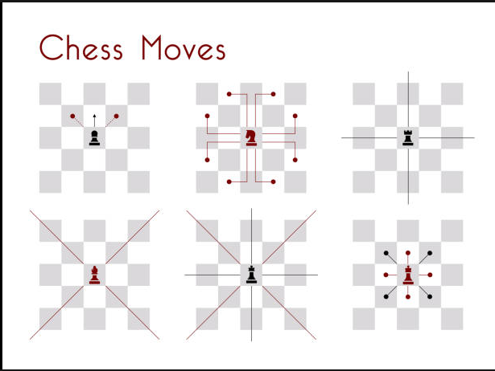
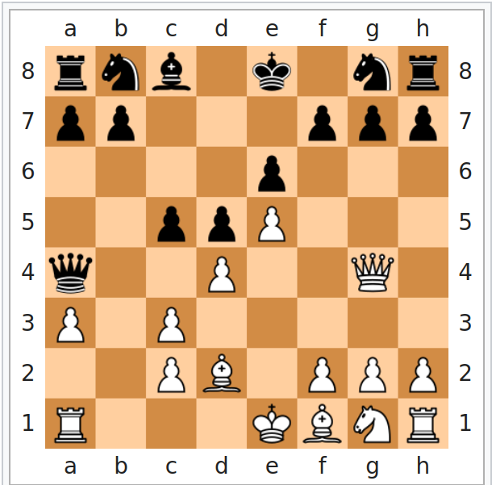
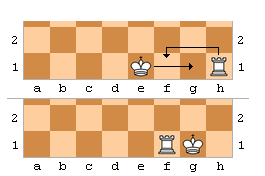

# Rapport du lab08 Chess game

Auteur : Kevin Auberson, Leonard Klasen

- [Introduction](#introduction)
- [Implémentation du jeu](#implémentation-du-jeu)
- [Implémentation du package mouvement](#implémentation-du-package-mouvement)
  - [Direction](#direction)
  - [Diagonal](#diagonal)
  - [Horizontal](#horizontal)
  - [Jump](#jump)
  - [Mouvement](#mouvement)
  - [Vertical](#vertical)
- [Implémentation du package piece](#implémentation-du-package-piece)
  - [Piece](#piece)
  - [MovementType](#movementtype)
  - [toutes les classes des différentes pièces](#toutes-les-classes-des-différentes-pièces)
  - [Board](#board)
    - [La promotion](#la-promotion)
    - [Castling](#castling)
    - [isCheck](#ischeck)
  - [Cell](#cell)
- [Tests](#tests)
- [A compléter](#a-compléter)
- [Pour conclure](#pour-conclure)

## Introduction

Le but de ce travail pratique est d'implémenter un jeu d'échecs. Pour se faire nous possédons d'une interface graphique et d'un mode console.

Dans ce travail pratique nous avons donc du créer toute les fonctions nécessaires au déplacement des pièces, de leurs logiques et des "calcul" nécessaires pour créer le jeu.

Il nous a fallu également implémenter les quelques fonctions spéciales du jeu comme `le grand roque`, `la prise en passant` etc...

## Implémentation du jeu

Lors des premières réflexions du jeu, nous avons réalisé un UML à la main afin de mieux comprendre comment le fonctionnement du jeu. A la fin du laboratoire nous avons réalisé l'UML définitif pour notre implémentation.

Pour implémenter ce laboratoire nous avons du rajouter plusieurs class java et nous les avons regrouper dans différents packages.

Nous avons un package `chess` qui contient les fichiers sur l'implémentation graphique et console du programme ainsi que les fichiers définissant les types de pièces et leurs couleurs.

Puis nous avons un package `engine` qui comprend tous les fichiers nécessaire au bont fonctionnement de notre jeu. 

Le pacakge `engine` comprend 2 packages ainsi que les fichiers `board` qui nous permet de représenter le plateau du jeu et `Cell` qui nous permet de représenter chaque case de l'échecier.

Les deux autres package, `mouvement` et `piece` nous permettent de construire la logique du jeu.

## Implémentation du package mouvement

Dans ce package nous avons créer les classes de déplacements suivantes : 

- Diagonal
- Direction 
- Horizontal
- Jump 
- Mouvement 
- Vertical

Ce package contient la classe abstraite `Movement.java` qui définit une méthode abstraite qui est implémentée dans chaque classe de mouvement et qui permet de vérifier si le mouvement
est possible lors d'un déplacement d'une pièce.

### Direction
Ce fichier contient un enum permettant d'indiquer toutes les directions possible qui peuvent être effectuées par les pièces.

### Diagonal
Cette classe nous permet d'effectuer et de vérifier tous les mouvements diagonaux. Il faut pouvoir gérer aussi bien les déplacements de chaque équipe (vis-à-vis du sens de l'équipe sur le plateau) mais également les déplacements sur l'axe des X et sur l'axe des Y. Il nous faut également vérifier que sur la case d'arrivée voulue il n'existe pas actuellement une pièce de sa propre équipe sinon la pièce ne peut pas se déplacer.

En diagonal peuvent se déplacer le pion lorsqu'il y a une capture possible, le fou, et la reine.

### Horizontal
Cette classe nous permet de vérifier et effectuer les déplacements latéraux (GAUCHE, DROITE). Pour vérifier ce déplacement, il nous suffit de calculer la distance du déplacement et le sens puis de vérifier qu'il est bien possible et qu'il n'y a pas de pièce à cet emplacement.

### Jump
une classe servant au déplacement du cheval. Pour se faire nous avons utilisé la classe enum `Direction` afin de définir les différents chemin possible. 
Les chemins possible sont : 

- L_UP_LEFT 
- L_UP_RIGHT
- L_LEFT_DOWN
- L_LEFT_UP
- L_RIGHT_DOWN
- L_RIGHT_UP
- L_DOWN_LEFT
- L_DOWN_RIGHT

Ces chemins sont à comprendre dans le sens de lecture, c'est-à-dire, si nous prenons L_UP_LEFT alors le cheval se déplace de 2 cases vers le haut puis 1 case vers la gauche.
Ainsi de suite pour le reste des mouvements...

### Mouvement
Cette classe abstraite possède une fonction boolean permettant de savoir si la pièce à la possibilité de se déplacer dans le jeu actuel. Cette fonction va donc être définie dans les différentes classes existantes pour les déplacements des pièces.

Cette fonction prend en paramètre la plateau de jeu, la position initiale et la position voulue de la pièce ainsi que la distance du déplacement et la couleur de la pièce.

Graĉe à ces informations nous pouvons vérifier et implémenter chaque vérification de mouvement possible.

### Vertical
Cette classe permet de gérer les déplacements verticaux en vérifiant si ces déplacements sont possibles. On vérifie que à l'endroit voulu il n'y ait pas de pièces déjà présentes dans quel cas il n'est pas possible de se déplacer. On définit comment chaque équipe se déplace par rapport à l'axe Y du plateau.

Donc l'équipe blanche se déplace verticalement vers le haut (sauf pour les pièces pouvant se déplacer dans plusieurs sens) et l'équipe noire se déplace vers le bas (sauf pour les pièces pouvant se déplacer dans plusieurs sens).

## Implémentation du package piece
Dans ce package nous avons toutes les classes définissant les types de pièces présentent sur le plateau du jeu.

### Piece
Cette classe abstraite nous permet de définir une pièce et offre quelques fonctions permettant d'obtenir par exemple la couleur de la pièce, son type, son emplacement, etc...

### MovementType
Cette classe enum nous permet de définir les différents mouvement spéciaux tel que le `grand roque` et le `petit roque` ainsi que le `en passant`, la `promotion`, etc...

### toutes les classes des différentes pièces
Pour toutes les autres classes présentent dans ce package, elles permettent de définir les pièces en initialisant leur constructeur avec les mouvements possible pour cette pièce.
Par exemple pour la classe `bishop` représentant le fou, les mouvements possible sont les diagonales et donc dans le constructeur on lui donne sa couleur, son type de pièce, 
le nombre de case maximale de déplacement ainsi que les mouvements possibles, donc ici des diagonales.

### Board
Cette classe est responsable de la gestion du plateau de jeu, du mouvement des pièces et de la logique du jeu.
Le board est un tableau 2D de cases `Cell` pour représenter le plateau. 

La fonction `move` est une fonction qui permet de gérer le déplacement d'une pièce de sa position initiale à une autre position du plateau. Elle vérifie qu'elle mouvement est demandé et permet de mettre à jour le plateau en fonction. Elle permet également de vérifier si un mouvement spécial a été effectué comme : 
  - le roque
  - la promotion
  - check
  - etc...

Dans cette classe il s'agit aussi des toutes les fonctions nécessaires aux mouvement spéciaux.

#### La promotion
Cette fonction permet une fois le pion arrivé au bout du plateau, de pouvoir échanger ce pion avec soit un cheval, une reine, un fou, ou encore une tour. Il nous a fallu donc changer la pièce vis-à-vis du choix de l'utilisateur puis supprimer le pion et la mettre à jour la nouvelle pièce sur le plateau de manière visuelle également.

#### Castling
Le `Roque` en français, et le déplacement du roi avec la tour. Pour se faire il nous à fallu vérifier que le roi ne soit pas en échec, et que ce dernier ainsi que la tour n'aient pas encore bougé de la partie sans quoi le roque n'est pas possible. 

Voici à quoi ressemble ce mouvement :

#### isCheck
Cette fonction vérifie si le roi est en position d'échec. Si tel est le cas alors aucun mouvement qui n'aura pas pour but de protéger le roi ne sera possible.

Pour se faire, on parcours tout le plateau et on vérifie si il existe une pièce ou non à telle case et si c'est le cas alors on vérifie son mouvement avec la fonction validateMov afin de vérifier si le mouvement de cette pièce peut induire un échec.

### Cell
Cette classe compose les cases du plateau de jeu. Chaque cases contient les coordonnées x et y, ainsi que la pièce présente sur cette case.

On peut donc vérifier si la case est vide, placer une pièce, enlever une pièce, récupérer la pièce pour connaître ensuite son type ou sa couleur par exemple, et ses coordonnées.

## Tests

Voici tous les tests effectués que nous avons pu expérimenté tout au long du développement du jeu :

| No  | Description                                                                                                            | OK / NOK |
| --- | ---------------------------------------------------------------------------------------------------------------------- | -------- |
| 1   | Le pion peut avancer d'une case                                                                                        | OK       |
| 2   | Le pion peut capturer un pion adverse                                                                                  | OK       |
| 3   | Le cavalier peut se déplacer en L                                                                                      | OK       |
| 4   | Le fou peut se déplacer en diagonal dans toutes les directions                                                         | OK       |
| 5   | La reine peut se déplacer librement dans toutes les directions                                                         | OK       |
| 6   | La tour peut se déplacer correctement                                                                                  | OK       |
| 7   | Le pion peut, au premier déplacement uniquement, se déplacer de 2 cases                                                | OK       |
| 8   | La promotion fonctionne en choisissant chaque pièce proposée                                                           | OK       |
| 9   | Le petit roque fonctionne complètement                                                                                 | NOK      |
| 10  | Le grand roque fonctionne complètement                                                                                 | NOK      |
| 11  | La fonction en passant fonctionne                                                                                      | NOK      |
| 12  | Le cavalier peut se déplacer par dessus des pièces alliées                                                             | OK       |
| 13  | Le jeu détecte correctement le Check                                                                                   | NOK      |
| 14  | Chaque pièce possède son propre mouvement et aucune autre pièce ne peut l'effectuer                                    | OK       |
| 15  | Le fou ne peut pas sauter par dessus des pièces alliées                                                                | OK       |
| 16  | Impossible de faire un mouvement autre que protéger le roi si il est en echec                                          | OK       |
| 17  | Les commentaires en console fonctionne correctement en fonction des déplacements des pièces                            | OK       |
| 18  | Possibilité de relancer new game à n'importe quel moment                                                               | OK       |
| 19  | Si le roi ou la tour ont effectués un mouvement il n'est pas possible de lancer la fonction petit roque ou grand roque | OK       |

## A compléter
Dans notre code nous sommes conscient que certaines fonctionnalités ne fonctionnent pas totalement. Nous avons passé pas mal de temps afin d'essayer de résoudre le problème mais nous n'avons malheureusement pas réussi à résoudre tous les problèmes...

Ceci est le cas pour :
- La fonction en passant qui ne fonctionne pas malgré ce que nous avons implémenté.
- Les pions qui peuvent se déplacer en diagonal arrière pour une raison que nous n'avons pas trouvé. La diagonal avant, donc la capture fonctionne corretement. 
- La fonction check fonctionne mais n'est pas totalement au point. Dans certain cas, elle ne se déclenche pas alors que la situation est en échec. Par exemple si dans la diagonale du roi ennemi nous mettons la reine, alors notre fonction détecte check malgré le fait qu'il y a encore 2 pions sur la trajectoire ce qui ne devrait donc pas déclencher le check.  
- La fonction du petit roque et grand roque fonctionne lorsqu'il s'agit de ne pas s'exécuter si le roi ou la tour ont déjà eu un déplacement, mais lorsque l'on exécute la fonction dans les bonnes conditions, la fonction throw une erreur mais le jeu peut continuer malgré la disparition de la tour...

## Pour conclure
Pour conclure, ce laboratoire nous à permis de pouvoir mieux comprendre et nous à permis de pratiquer les différents sujets appris pendant les cours et nous à permis de nous familiariser avec java et ses concepts. 

Ce laboratoire nécessite également une bonne compréhension des échecs, et des différents déplacements ou fonctions possible dans le jeu. Cela nous à demandé également une certaine réflexion stratégique afin des les implémenter correctement dans notre code.